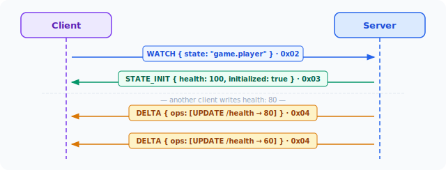

<p align="center">
  <a href="https://github.com/orkestri/SODP/actions/workflows/ci.yml">
    
  </a>
  
  <a href="https://www.npmjs.com/package/@sodp/client">
    
  </a>
  <a href="https://www.npmjs.com/package/@sodp/react">
    
  </a>
  <a href="https://pypi.org/project/sodp-client/">
    
  </a>
</p>

<h1 align="center">SODP — State-Oriented Data Protocol</h1>

<p align="center">
  <strong>Continuous state synchronization over WebSocket — delta-only, reconnect-safe, sub-millisecond latency.</strong>
</p>

<p align="center">
  <a href="#servers">Servers</a> ·
  <a href="#clients">Clients</a> ·
  <a href="#features">Features</a> ·
  <a href="#documentation">Docs</a> ·
  <a href="SPECIFICATION.md">Protocol spec</a>
</p>

---

Instead of polling or request-response, clients subscribe to named state keys and receive a full snapshot followed by a stream of structural diffs (deltas) as the state evolves. The result is a persistent replica that is always current and always minimal on the wire.



---

## Why SODP?

| | REST + polling | SSE | gRPC stream | **SODP** |
|---|---|---|---|---|
| Full object on every update | yes | yes | yes | **no — delta only** |
| Client drives timing | yes | no | no | no |
| Native browser support | yes | yes | no | **yes (WebSocket)** |
| Reconnect with replay | manual | manual | manual | **built-in** |
| Bytes per update (11-field obj) | 353 | 353 | 363 | **52** |
| P50 latency (localhost) | 78 µs | 78 µs | 157 µs | **55 µs** |

*Benchmark: release build, localhost, 11-field object — see `src/bin/bench.rs`.*

---

## Features

- **WATCH / DELTA stream** — subscribe once, receive only what changed
- **CALL methods** — `state.set`, `state.patch`, `state.set_in`, `state.delete`, `state.presence`
- **RESUME** — on reconnect the server replays missed deltas; clients never need to re-fetch
- **Persistence** — segmented append log, crash-safe, auto-compacted
- **JWT authentication** — HS256 (shared secret) or RS256 (public key); token providers for rotation
- **Per-key ACL** — dot-pattern rules, `{sub}` capture, claim-aware permissions; built-in IdP presets
- **Rate limiting** — per-session write and watch limits; `ERROR 429` without closing the connection
- **Schema validation** — SDL enforced server-side before every write; `ERROR 422` on violation
- **Presence** — session-scoped path bindings auto-removed on disconnect (no ghost entries)
- **Health check** — HTTP endpoint for load-balancer probes
- **Prometheus metrics** — mutation latency, fanout size, connection count, rate-limited frames
- **Graceful shutdown** — `SIGTERM` / Ctrl-C drains sessions cleanly
- **Redis clustering** — cross-node state sync and fanout for horizontal scaling

---

## Servers

SODP ships two production-ready server implementations. Both are wire-compatible — any client works with either.

### Rust server

The reference implementation. Highest throughput, lowest latency, Docker image on GHCR.

```bash
# Build from source
cargo build --release

# Ephemeral (in-memory only)
./target/release/sodp-server 0.0.0.0:7777

# With persistence
./target/release/sodp-server 0.0.0.0:7777 /var/lib/sodp/log

# With persistence + schema validation
./target/release/sodp-server 0.0.0.0:7777 /var/lib/sodp/log /etc/sodp/schema.json
```

```bash
# Docker
docker pull ghcr.io/orkestri/sodp-server:latest
docker run -p 7777:7777 ghcr.io/orkestri/sodp-server:latest
```

| Env var | Purpose |
|---|---|
| `SODP_JWT_SECRET` | HS256 shared secret |
| `SODP_JWT_PUBLIC_KEY_FILE` | RS256 public key PEM path |
| `SODP_ACL_FILE` | ACL rules JSON path |
| `SODP_HEALTH_PORT` | Health endpoint port |
| `SODP_METRICS_PORT` | Prometheus metrics port |
| `SODP_RATE_WRITES_PER_SEC` | Write rate limit per session |
| `SODP_RATE_WATCHES_PER_SEC` | Watch rate limit per session |
| `SODP_BACKPRESSURE_LIMIT` | Bounded channel capacity per session (default 1024) |
| `SODP_REDIS_URL` | Redis URL for horizontal scaling |

### Go server

Idiomatic Go implementation — run it standalone or embed it as a library in any Go service.

**Standalone binary** (release binaries at [Releases](https://github.com/orkestri/SODP/releases)):
```bash
# Build from source
cd sodp-go && go build -o sodp-server ./cmd/sodp-server

./sodp-server -addr :7777
./sodp-server -addr :7777 -persist /var/lib/sodp      # with persistence
./sodp-server -addr :7777 -acl config/acl.json        # with ACL
./sodp-server -addr :7777 -jwt-secret $JWT_SECRET     # with JWT auth
```

**Embedded library:**
```go
import (
    "net/http"
    sodp "github.com/orkestri/sodp-go"
)

srv := sodp.NewServer(
    sodp.WithBackpressureLimit(256),
    sodp.WithJWTSecret([]byte(os.Getenv("JWT_SECRET"))),
    sodp.WithACLFile("config/acl.json"),
)

http.HandleFunc("/sodp", srv.HandleWS)
http.ListenAndServe(":7777", nil)
```

---

## Clients

| Package | Install | Language |
|---|---|---|
| [`@sodp/client`](client-ts/) | `npm i @sodp/client` | TypeScript / JavaScript |
| [`@sodp/react`](react-sodp/) | `npm i @sodp/react` | React hooks |
| [`sodp-client`](sodp-py/) | `pip install sodp-client-client` | Python |
| [`io.sodp:sodp-client`](sodp-java/) | see below | Java 17+ |

### TypeScript / JavaScript

```bash
npm i @sodp/client
```

```typescript
import { SodpClient } from "@sodp/client";

const client = new SodpClient("ws://localhost:7777");
await client.ready;

// Subscribe — fires on every change
const unsub = client.watch<{ score: number }>("game.score", (value, meta) => {
  console.log("score:", value?.score, "version:", meta.version);
});

// Mutate
await client.set("game.score", { score: 42 });

unsub();
client.close();
```

### React

```bash
npm i @sodp/client @sodp/react
```

```tsx
import { SODPProvider, useSodpState } from "@sodp/react";

function App() {
  return (
    <SODPProvider url="ws://localhost:7777">
      <Scoreboard />
    </SODPProvider>
  );
}

function Scoreboard() {
  const [score, meta] = useSodpState<{ value: number }>("game.score");

  if (!meta?.initialized) return <p>Loading…</p>;
  return <h1>Score: {score?.value}</h1>;
}
```

### Python

```bash
pip install sodp-client
```

```python
import asyncio
from sodp.client import SodpClient

async def main():
    client = SodpClient("ws://localhost:7777")
    await client.ready

    client.watch("game.score", lambda value, meta: print("score:", value))
    await client.set("game.score", {"score": 42})
    await asyncio.sleep(1)
    client.close()

asyncio.run(main())
```

### Java

```xml
<!-- Maven — GitHub Packages (github.com/orkestri/SODP) -->
<dependency>
  <groupId>io.sodp</groupId>
  <artifactId>sodp-client</artifactId>
  <version>0.2.1</version>
</dependency>
```

```java
SodpClient client = new SodpClient("ws://localhost:7777");
client.ready().get();

client.watch("game.score", (value, meta) ->
    System.out.println("score: " + value + " v" + meta.version()));

client.set("game.score", Map.of("score", 42));
```

---

## Documentation

| Document | Contents |
|---|---|
| [docs/tutorial.md](docs/tutorial.md) | Step-by-step: from zero to a production server with auth, ACL, schema |
| [docs/guide.md](docs/guide.md) | Full API reference — state methods, JWT, ACL presets, rate limiting, schema SDL |
| [SPECIFICATION.md](SPECIFICATION.md) | Wire protocol — frame format, connection lifecycle, body schemas |
| [docs/architecture.md](docs/architecture.md) | Server internals — state store, delta engine, fanout, persistence |
| [docs/deployment.md](docs/deployment.md) | TLS termination, nginx/Caddy, systemd, Docker, env-var reference |
| [docs/clustering.md](docs/clustering.md) | Horizontal scaling — Redis state sync, cross-node fanout, failure modes |

---

## Repository layout

```
src/             Rust server (lib + sodp-server binary)
sodp-go/         Go server (library + sodp-server binary)
client-ts/       @sodp/client  — TypeScript / JavaScript
react-sodp/      @sodp/react   — React hooks
sodp-py/         sodp           — Python
sodp-java/       io.sodp:sodp-client — Java
demo-collab/     Collaborative editor demo (presence, live cursors)
sodp-middleware/ ACL + rate-limiter middleware crate
docs/            Protocol spec, deployment guide, SVG diagrams
```

---

## License

MIT
