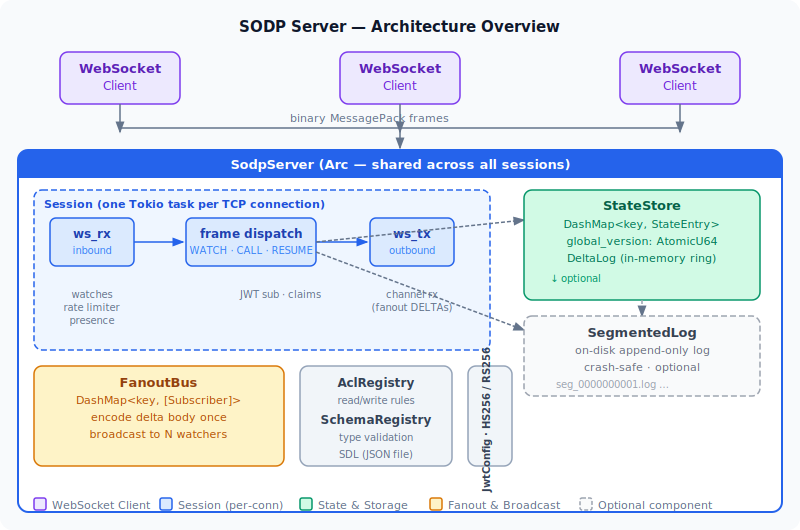
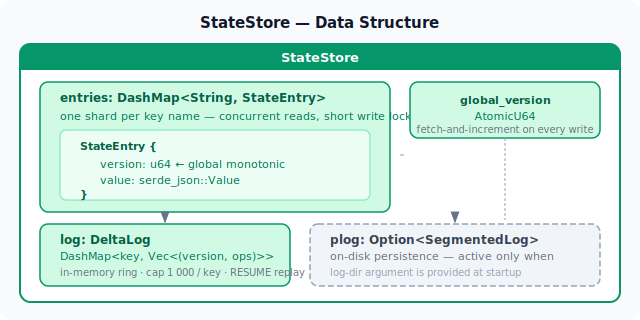
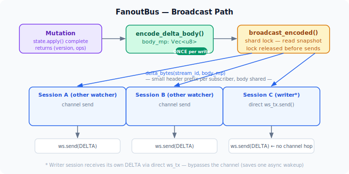
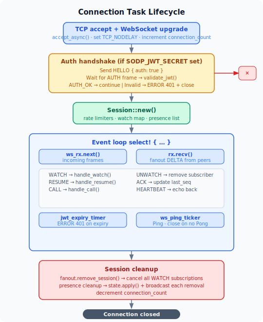
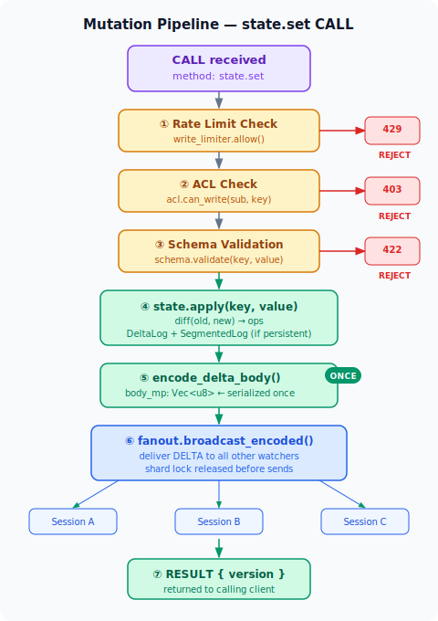

# SODP Server Architecture

This document explains how the SODP server works internally — the data
structures, the execution pipeline, and the design decisions behind them.
It is intended for contributors and for operators who need to reason about
performance, memory, or failure behaviour.

---

## High-level picture



---

## Core components

### SodpServer (server.rs)

The top-level struct, shared across all sessions via `Arc`.  Holds:

| Field | Type | Description |
|---|---|---|
| `state` | `Arc<StateStore>` | All key–value state |
| `fanout` | `Arc<FanoutBus>` | Subscription registry + broadcast |
| `schema` | `Option<Arc<SchemaRegistry>>` | SDL validator |
| `acl` | `Option<Arc<AclRegistry>>` | Access-control rules |
| `jwt_config` | `Option<JwtConfig>` | HS256 or RS256 key |
| `connection_count` | `Arc<AtomicUsize>` | Live connection counter (health check) |
| `rate_writes_per_sec` | `Option<u32>` | Write rate cap |
| `rate_watches_per_sec` | `Option<u32>` | Watch/resume rate cap |
| `ws_ping_interval` | `u64` | Seconds between WS pings |

`SodpServer` is immutable after construction.  Sessions read from it but never
mutate it directly.

---

### Session (session.rs)

One `Session` struct lives entirely inside one connection task.  It is never
shared across tasks — no locks needed.

| Field | Type | Description |
|---|---|---|
| `id` | `String` | UUID; used to exclude self from fanout |
| `sub` | `Option<String>` | Authenticated JWT `sub` claim |
| `claims` | `serde_json::Value` | All extra JWT claims (for ACL) |
| `watches` | `HashMap<u32, WatchEntry>` | Active subscriptions |
| `presence` | `Vec<PresenceEntry>` | Session-owned paths (auto-removed on close) |
| `write_limiter` | `Option<RateLimiter>` | Per-session write rate limiter |
| `watch_limiter` | `Option<RateLimiter>` | Per-session watch/resume rate limiter |

The session is created fresh on each TCP connect.  Subscriptions from a
previous connection are not migrated — the client sends `RESUME` frames
to re-establish them.

---

### StateStore (state.rs)

Concurrent, versioned in-memory state store.



**`apply(key, new_value)` — the hot path:**

1. Atomically fetch-and-increment `global_version` (SeqCst).
2. Read the current value (read lock on DashMap shard, released before write).
3. Call `diff(old, new)` to compute delta ops — O(changed fields).
4. Write the new `StateEntry` (write lock on DashMap shard).
5. If ops non-empty: append to in-memory `DeltaLog`; if `plog` active, append to disk log.
6. Return `(version, ops)`.

The DashMap shards mean that concurrent mutations to different keys don't
contend.  Mutations to the *same* key serialize at the shard level.

---

### DeltaLog (state.rs, private)

In-memory ring buffer of recent mutations, keyed by state key.

```
DashMap<String, Vec<(version: u64, ops: Vec<DeltaOp>)>>
```

Capacity: **1 000 entries per key**.  When the cap is reached, the oldest
entries are dropped (`.drain(..excess)`).

Used exclusively by `handle_resume`: when a client reconnects and sends
`RESUME { since_version }`, the server calls `deltas_since(key, since_version)`
and replays each stored delta as a DELTA frame.

If the client's `since_version` predates the retained window (the entry was
evicted), `since()` returns an empty vec.  `handle_resume` detects this and
falls back to sending a full `STATE_INIT` snapshot — identical to a fresh WATCH.

---

### SegmentedLog (log.rs)

On-disk append-only log for persistence.  Only active when a `log-dir` argument
is provided at startup.

**File layout:**

```
/var/lib/sodp/log/
  seg_0000000000.log    ← older segment (read-only after rotation)
  seg_0000000001.log    ← current write segment
```

**Record format** (per entry, variable length):

```
[ 4 bytes: payload_len (u32 LE) ][ payload_len bytes: rmp_serde(LogEntry) ]
```

Each `LogEntry` stores: `version`, `key`, `ops` (delta ops), `value` (full post-mutation value).

**Durability:** each `append` flushes the `BufWriter` to the OS page cache.
The server survives process crashes without data loss.  For power-loss or OS
crash durability, un-comment the `sync_data()` call in `log.rs` (costs ~1–5 ms
per write on SSDs).

**Crash recovery:** if the server dies mid-write, the last record may be
truncated.  On startup, `replay_segment` reads records until a truncation is
detected, then calls `file.set_len(last_good_byte)` to truncate the file.

**Rotation:** a new segment file is created when the current one reaches
100 000 entries.

**Compaction:** triggered automatically when more than 3 segments exist.
The compactor:
1. Writes a snapshot segment: one entry per live key, `ops = []` (marks as
   non-delta, so no DeltaLog population on next restart).
2. Opens a fresh write segment.
3. Deletes all pre-snapshot segments.

After compaction, a RESUME whose `since_version` predates the snapshot falls
back to STATE_INIT — the same graceful behavior as delta eviction.

---

### FanoutBus (fanout.rs)

Registry of all active WATCH subscriptions.  Optimised for high-concurrency
broadcast.

```
DashMap<String, Vec<Subscriber>>
```

Each `Subscriber` holds: `session_id`, `stream_id`, and a `tx: UnboundedSender`
into the session's write channel.

**Broadcast path (hot path):**



The delta body (`body_mp`) is encoded **once** per mutation and shared across
all N subscribers.  Per-subscriber cost is one small allocation for the wire
framing prefix + a pointer copy into the channel.

The triggering session receives its own DELTA via a **direct `ws_tx.send()`**
call in `handle_call` — bypassing the channel entirely.  This saves one async
wakeup on the write path.

---

### Delta engine (delta.rs)

Computes the minimal set of ops that transforms `old` into `new`.

```
diff(old: &Value, new: &Value) → Vec<DeltaOp>
```

Algorithm:
- **Objects** — recurse field by field:
  - Field in `new` but not `old` → `ADD`
  - Field in both, values differ → recurse if both are objects; else `UPDATE`
  - Field in `old` but not `new` → `REMOVE`
- **Anything else** — if `old != new` → `UPDATE` at the current path
- **No change** → no op emitted

Complexity: **O(changed_fields)**, not O(object_size).  A 100-field object
where only `health` changed produces exactly one op.

Arrays are treated atomically — any array change produces a single `UPDATE`
on the array's path.

---

### AclRegistry (acl.rs)

Loaded once at startup from `SODP_ACL_FILE`.  Immutable after construction —
no locks needed.

**Rule matching** (`match_pattern`):

Splits pattern and key by `.`.  Walks segments:
- `{sub}` → matches any single segment, captures its value
- `*` → suffix wildcard; matches one or more remaining segments; returns immediately
- literal → must equal the key segment exactly

First matching rule wins.

**Permission evaluation** (`check_permission`):

1. `"*"` → always allow
2. `"{sub}"` → `session.sub == captured_segment`
3. `"X:Y"` (contains colon) → look up X in `claim_mappings` to get a JWT path,
   resolve the claim via `resolve_claim(claims, path)`, check array membership
   or scalar equality against Y (where Y may be `{sub}`)
4. literal → `session.sub == literal`

**Claim resolution** (`resolve_claim`) — two-phase strategy:

1. Direct key lookup in the claims object.  Handles keys with dots or colons
   (`"cognito:groups"`, `"https://myapp.com/roles"`) that should not be
   traversed.
2. Dot-notation traversal.  Handles nested claims like `"realm_access.roles"`.

---

### SchemaRegistry (schema.rs)

Loaded from a JSON file at startup.  Each key maps to a `SchemaNode`:

- `Simple(type_name)` — shorthand, e.g. `"Int"`
- `Full { type_name, nullable, fields }` — with sub-schema for objects

Validation runs before every `state.set` / `state.patch` / `state.set_in`
write, before `state.apply()`.  If validation fails, `ERROR 422` is returned
and the state is not modified.

---

### RateLimiter (session.rs)

Fixed 1-second window counter per session.

```
struct RateLimiter {
    max_per_sec:  u32,
    count:        u32,
    window_start: Instant,
}
```

`allow()` resets `count` to 0 whenever `window_start.elapsed() >= 1s`, then
increments and returns `true` if within limit, `false` otherwise.

This approach can allow up to 2× `max_per_sec` across a window boundary —
acceptable for SODP's write and watch paths where burst tolerance is desirable.
A token-bucket limiter would be stricter but more complex.

---

## Connection task lifecycle

Each accepted TCP connection spawns one Tokio task:



After the event loop breaks (any reason: client close, JWT expiry, ping
timeout, server shutdown):

1. `fanout.remove_session(session_id)` — cancel all WATCH subscriptions.
2. For each presence entry: compute `json_remove_in(current, path)` → `state.apply()` → broadcast.
3. Decrement `connection_count`.

---

## Mutation pipeline

A `state.set` CALL goes through:



Total encoding cost: **one MessagePack serialization per mutation**, regardless
of the number of watchers.

---

## Fanout timing


Delivery to each subscriber is asynchronous — the mutation handler does not
await the write tasks.  The channel is unbounded, so the sender never blocks.
If a client is slow, its channel backlog grows; when the WebSocket buffer fills,
`ws.send()` will eventually return an error and the session closes.

---

## Memory footprint

| Structure | Size estimate |
|---|---|
| `StateEntry` per key | value size + 8 bytes (version) |
| `DeltaLog` per key | up to 1 000 × (ops array size) |
| `Subscriber` per watcher | ~200 bytes (channel handle + metadata) |
| `Session` per connection | ~1 KB + watch entries + presence entries |

For a server with 10 000 active connections each watching 5 keys with small
values, expect roughly 50–100 MB of RAM.

---

## Graceful shutdown

Triggered by `SIGTERM` or `Ctrl-C` via a `CancellationToken` (tokio-util).

1. The accept loop stops accepting new connections.
2. Each session's event loop adds a `cancelled()` arm to its `select!`.
3. Sessions close their WebSocket, run presence cleanup, and exit.
4. The main task joins after all session tasks finish.

---

## Design decisions

**Why DashMap?**
Lock-free reads for the common case (read a key's current value) and short
write-lock windows (insert a new StateEntry).  Sharding keeps contention low
even with many concurrent mutations to different keys.

**Why unbounded channels for fanout?**
Bounded channels would cause the mutation handler to block if a slow subscriber
fills its buffer.  This would serialize mutations — unacceptable for high
fanout.  Instead, slow clients accumulate backlog until their TCP send buffer
fills, at which point `ws.send()` errors and the session closes cleanly.

**Why encode the delta body once?**
For 1 000 watchers of the same key, a naive approach would serialize the body
1 000 times.  We serialize once into `body_mp` and then each subscriber just
prepends a small (6–12 byte) frame header.  At 1 000 watchers this is a 1 000×
reduction in serialization CPU.

**Why no `biased` in the select!?**
`biased` processes arms in declaration order, starving later arms under high
load.  Without it, Tokio's scheduler picks arms pseudo-randomly, giving all
arms fair progress even under sustained high write load.

**Why direct ws_tx write for own-session deltas?**
A CALL from session A that mutates a key that session A is also watching needs
to deliver a DELTA to session A.  Going through the channel would add one async
wakeup and one allocation.  Writing directly to `ws_tx` is cheaper and
synchronous with the handler — the DELTA arrives before the RESULT, matching
the natural ordering.

**Why SeqCst for the version counter?**
The version counter is the authoritative ordering mechanism for all mutations.
SeqCst ensures a consistent total order visible to all threads.  The overhead
on x86 is zero (a single `lock xadd`); on ARM it adds a full barrier, but
version bumps are not on the per-byte hot path.
