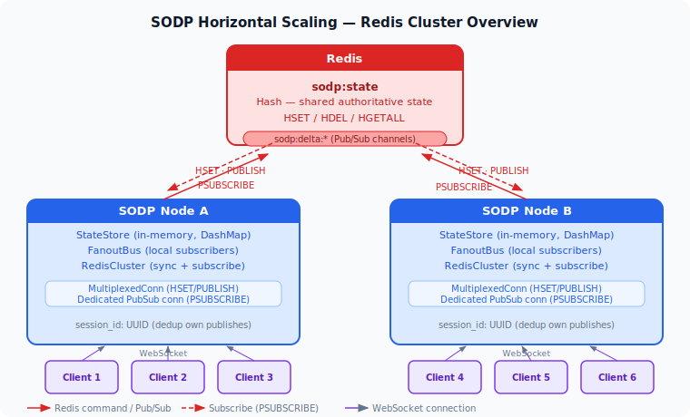
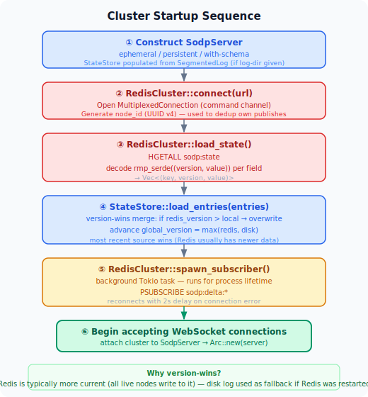
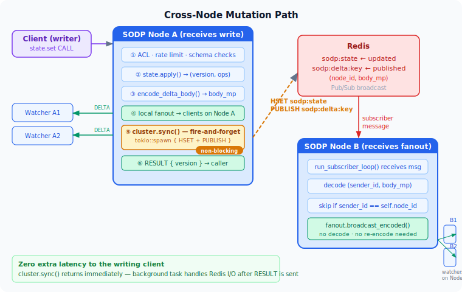

# SODP Horizontal Scaling with Redis

This document explains how SODP achieves horizontal scaling — running multiple
server processes that collectively serve a single shared state space — using
Redis as the coordination layer.

---

## The problem

A single SODP server is a fully self-contained process: all state lives in
`StateStore` (an in-memory `DashMap`), and all fanout happens through `FanoutBus`
(an in-process channel registry).  That means:

- Two clients on **different nodes** watching the same key will not see each
  other's mutations: node A's `FanoutBus` has no subscribers registered from
  node B.
- A node that crashes and restarts loses all in-memory state (unless the
  on-disk `SegmentedLog` is used, but that only helps the **same** node).

Horizontal scaling requires two things:

1. **Shared state** — every node must start with the same picture of the world,
   and every write must eventually reach all nodes.
2. **Cross-node fanout** — when node A receives a mutation, watchers on nodes
   B and C must also receive the DELTA frame.

---

## Solution overview

Redis solves both problems with two primitives:

| Primitive | Used for | Redis command |
|---|---|---|
| Hash `sodp:state` | Shared authoritative state store | `HSET` / `HDEL` / `HGETALL` |
| Pub/Sub channels | Cross-node delta delivery | `PUBLISH` / `PSUBSCRIBE` |

Every node is simultaneously a **publisher** (it writes mutations to Redis and
publishes deltas) and a **subscriber** (it listens for deltas from peer nodes
and routes them to local watchers).



---

## Activation

Clustering is **opt-in** and completely **backward-compatible**: if
`SODP_REDIS_URL` is not set the server behaves exactly as before — no Redis
dependency, no extra latency, no code path change.

```bash
# Single-node (default — no Redis)
./sodp-server 0.0.0.0:7777

# Clustered
SODP_REDIS_URL=redis://127.0.0.1/ ./sodp-server 0.0.0.0:7777
```

The URL follows the standard Redis connection string format supported by the
`redis` crate: `redis://[:<password>@]<host>[:<port>][/<db>]`.

---

## Startup sequence

When `SODP_REDIS_URL` is set, `main()` runs this sequence **before** accepting
any WebSocket connections:



**Why load Redis after the disk log?**  A node may have recent mutations on
disk (written before a clean shutdown) and older data in Redis (if Redis itself
was restarted).  By loading disk first and then applying Redis with a
version-wins merge, whichever source is more recent wins.  In practice, Redis
is almost always more current because all live nodes write to it.

**Why Arc::try_unwrap?**  `SodpServer` constructors return `Arc<SodpServer>`.
To attach the `cluster` field after the async Redis connection is established,
`main` temporarily unwraps the `Arc` back to a plain `SodpServer` (safe
because no tasks have been spawned yet — exactly one reference exists), mutates
the struct, and re-wraps it.

---

## Data model in Redis

### State: `sodp:state` (Hash)

One Redis hash field per SODP state key.

```
HGET sodp:state "game.player"
→ <binary: rmp_serde((version: u64, value: serde_json::Value))>
```

MessagePack encoding is used for compactness — the same codec SODP uses on the
wire — so no extra serialisation library is needed.

`version` is the global monotonic version from `StateStore::global_version`, the
same integer clients see in `STATE_INIT` and `DELTA` frames.  Storing it
alongside the value lets a new node populate its own version counter correctly
on startup.

### Fanout: `sodp:delta:{key}` (Pub/Sub)

One Redis Pub/Sub channel per SODP state key, named `sodp:delta:{key}`.

The published payload is a MessagePack tuple:

```
(node_id: String, body_mp: Vec<u8>)
```

`body_mp` is the **already-encoded SODP delta body** — the same bytes that
`encode_delta_body(version, ops)` produced for local fanout.  Peer nodes
decode it and pass it straight to their local `FanoutBus::broadcast_encoded()`.
No re-encoding is needed at any hop.

`node_id` is the UUID generated at startup.  Each node's subscriber uses it to
skip messages it published itself (since it already delivered them locally).

---

## Mutation path (write on node A)

Tracing a `state.set` call from start to finish:



The `cluster.sync()` call returns immediately — it spawns a background Tokio
task and does not `.await`.  The mutation handler is back to the client with
`RESULT` before Redis has even received the HSET command.  This means Redis
latency adds **zero** to the round-trip time seen by the client.

The `body_mp` bytes are passed by value into the background task (one
allocation, zero copies from the caller's perspective after the `tokio::spawn`).

---

## Cross-node fanout (receive on node B)


Node B's `FanoutBus` operates identically to node A's — it looks up the key's
subscriber list and sends the pre-encoded `body_mp` bytes to each session
channel.  No decoding, re-encoding, or value lookup is needed.

---

## Background subscriber

The subscriber is a single long-running Tokio task per node, structured as a
two-level loop:


A **dedicated** connection is required because the Redis protocol does not
allow mixing regular commands and Pub/Sub subscriptions on the same connection.
The `MultiplexedConnection` used for HSET / PUBLISH / HGETALL is a separate
connection.

`PSUBSCRIBE sodp:delta:*` (pattern subscribe) matches all delta channels
regardless of key name.  A single subscription handles an unlimited number of
SODP state keys.

On reconnect, the subscriber resubscribes automatically.  Deltas published
during the disconnection window are lost — clients whose RESUME would have
relied on them will fall back to `STATE_INIT` (the same graceful path as a
full local `DeltaLog` eviction).

---

## Delete path

`state.delete` uses `sync_delete` instead of `sync`:

```rust
cluster.sync_delete(key, body_mp)
```

This spawns a background task that:

1. `HDEL sodp:state key` — removes the key from the Redis hash.
2. `PUBLISH sodp:delta:key rmp_serde((node_id, body_mp))` — broadcasts the
   `REMOVE "/"` delta so peer nodes' watchers see the key disappear.

Peer nodes apply this delta via `fanout.broadcast_encoded` exactly as they
would any other mutation.  Their local `StateStore` does not automatically
remove the key — they would need their own `state.delete` call for that, but
since the next `WATCH` or `RESUME` from any client will receive a `STATE_INIT`
with `initialized: false`, the outcome is consistent.

---

## Presence cleanup

When a session disconnects, the server removes all presence-bound paths and
broadcasts the resulting DELTAs.  With clustering enabled, each such mutation
is also synced to Redis:

```rust
// session close — presence cleanup
for entry in &session.presence {
    let updated = json_remove_in(current, &entry.path);
    let (version, ops) = self.state.apply(&entry.state_key, updated.clone());
    if !ops.is_empty() {
        let body_mp = encode_delta_body(version, &ops);
        broadcast_timed(&self.fanout, &entry.state_key, &body_mp, None);
        if let Some(cluster) = &self.cluster {
            cluster.sync(entry.state_key.clone(), version, updated, body_mp);
        }
    }
}
```

This ensures presence tombstones (user cursor removal, session "online" flags,
etc.) propagate to every node when the originating node sees the disconnect.

---

## RESUME across nodes

SODP's RESUME mechanism works by replaying entries from the per-key `DeltaLog`
— an in-memory ring buffer that holds the last 1 000 mutations per key.

The `DeltaLog` is **not shared across nodes**.  If a client connects to node A,
disconnects, and reconnects to node B, node B has no local delta history for
that client.  Its `DeltaLog` for the relevant key may be empty or may contain
only mutations that arrived via the Redis subscriber.

In that case, `handle_resume` detects that `since_version` predates the
retained window and falls back to sending a full `STATE_INIT` snapshot — the
same behaviour as a local delta eviction.  Clients already handle this
transparently (the TypeScript and Python clients treat `STATE_INIT` on a resume
stream as a full refresh).

This is an accepted trade-off for v1: cross-node RESUME would require a shared
delta log (e.g. Redis Streams), adding significant complexity.  The fallback is
correct and safe.

---

## Connection management

`RedisCluster` holds two connection objects:

| Field | Type | Purpose |
|---|---|---|
| `client` | `redis::Client` | Factory for new connections (Pub/Sub) |
| `conn` | `redis::aio::MultiplexedConnection` | All non-Pub/Sub commands |

`MultiplexedConnection` implements `Clone` — each clone shares the same
underlying pipelined connection.  `sync()` and `sync_delete()` call
`self.conn.clone()` and move the clone into the spawned task.  There is no
`Mutex`, no contention: the multiplexer handles concurrent requests internally.

The Pub/Sub connection is opened fresh inside `run_subscriber_loop` each time
it (re)connects.  The `client` field is used for this.

---

## Failure modes

| Scenario | Behaviour |
|---|---|
| Redis unreachable at startup | Error logged; server starts in single-node mode |
| Redis connection lost mid-run | Syncs from `sync()` / `sync_delete()` fail silently (logged); subscriber reconnects after 2 s |
| Redis restart | Subscriber reconnects; state in Redis is lost unless Redis has its own persistence (AOF/RDB) |
| SODP node crash and restart | Loads state from Redis on startup; in-flight mutations from before crash are lost |
| Network partition (node can't reach Redis) | Local writes succeed; cross-node fanout stops until reconnect; state diverges temporarily |

SODP does not implement a consensus protocol.  Consistency guarantees are
**eventual**: if all nodes can reach Redis and there are no concurrent
conflicting writes to the same key, all nodes will converge to the same state.
Last-write-wins is determined by the global version counter on the **writing**
node — Redis does not enforce ordering between nodes.

---

## Redis configuration recommendations

**Persistence** — enable at least AOF (append-only file) so that the state
hash survives a Redis restart:

```
appendonly yes
appendfsync everysec
```

**Memory** — the `sodp:state` hash holds one entry per live SODP key.  With
small-to-medium values (< 1 KB per key) and thousands of keys, memory usage is
tens of megabytes.

**Keyspace** — all SODP data lives under two namespaces: `sodp:state` (one
hash) and `sodp:delta:*` (transient Pub/Sub channels, no persistent storage).
No key expiry is set — the application manages key lifetime via `state.delete`.

**High availability** — Redis Sentinel or Redis Cluster can be used; the
`redis` crate supports both via the URL scheme (`redis+sentinel://...`).  This
document does not cover HA Redis setup.

---

## Example: two-node deployment with Docker Compose

```yaml
# docker-compose.yml
services:
  redis:
    image: redis:7-alpine
    command: redis-server --appendonly yes
    volumes:
      - redis-data:/data

  sodp-a:
    image: sodp:latest
    environment:
      SODP_REDIS_URL: redis://redis:6379/
      SODP_HEALTH_PORT: "7778"
      RUST_LOG: info
    ports:
      - "7777:7777"
      - "7778:7778"
    command: ["sodp-server", "0.0.0.0:7777"]
    depends_on: [redis]

  sodp-b:
    image: sodp:latest
    environment:
      SODP_REDIS_URL: redis://redis:6379/
      SODP_HEALTH_PORT: "7778"
      RUST_LOG: info
    ports:
      - "7779:7777"
      - "7780:7778"
    command: ["sodp-server", "0.0.0.0:7777"]
    depends_on: [redis]

volumes:
  redis-data:
```

With this setup:

- Clients connecting to `:7777` land on `sodp-a`.
- Clients connecting to `:7779` land on `sodp-b`.
- A write on `sodp-a` appears within milliseconds on watchers connected to
  `sodp-b` via the Redis Pub/Sub path.
- Both nodes share the same state picture after startup.

In production, put a load balancer (nginx, HAProxy, Caddy) in front of both
ports and route WebSocket connections to whichever node has capacity.

---

## Relevant source files

| File | Role |
|---|---|
| `src/cluster.rs` | `RedisCluster` — all Redis interaction |
| `src/state.rs` | `StateStore::load_entries()` — startup state import |
| `src/server.rs` | `cluster.sync()` / `cluster.sync_delete()` call sites (6 total) |
| `src/main.rs` | Startup wiring — connect, load, unwrap Arc, spawn subscriber |
| `Cargo.toml` | `redis = { version = "0.27", features = ["aio", "tokio-comp"] }` |
