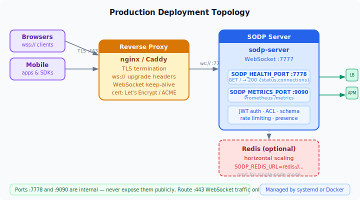

# Deploying SODP in Production

## TLS / wss://

SODP does not terminate TLS itself.  The recommended pattern — identical to
how you'd deploy any WebSocket service — is to put a **reverse proxy** in
front that handles TLS and forwards plain `ws://` traffic to the SODP server.

This keeps the SODP binary simple, lets you rotate certificates without
touching the server process, and reuses infrastructure you already run.



---

### nginx

```nginx
# /etc/nginx/sites-available/sodp
server {
    listen 443 ssl http2;
    server_name sodp.example.com;

    ssl_certificate     /etc/letsencrypt/live/sodp.example.com/fullchain.pem;
    ssl_certificate_key /etc/letsencrypt/live/sodp.example.com/privkey.pem;

    location / {
        proxy_pass          http://127.0.0.1:7777;
        proxy_http_version  1.1;

        # WebSocket upgrade — required
        proxy_set_header Upgrade    $http_upgrade;
        proxy_set_header Connection "upgrade";

        # Forward client IP
        proxy_set_header Host       $host;
        proxy_set_header X-Real-IP  $remote_addr;

        # Keep long-lived connections alive
        proxy_read_timeout  3600s;
        proxy_send_timeout  3600s;
    }
}

# Redirect HTTP → HTTPS
server {
    listen 80;
    server_name sodp.example.com;
    return 301 https://$host$request_uri;
}
```

Reload: `sudo nginx -s reload`

---

### Caddy (automatic HTTPS)

```caddyfile
# /etc/caddy/Caddyfile
sodp.example.com {
    reverse_proxy localhost:7777 {
        # Caddy handles TLS automatically via Let's Encrypt
        transport http {
            keepalive 1h
        }
    }
}
```

Caddy handles certificate issuance and renewal automatically.  No extra
configuration needed.

Reload: `sudo systemctl reload caddy`

---

### Health check

When `SODP_HEALTH_PORT` is set (e.g. `7778`), the server exposes a plain HTTP
endpoint suitable for load-balancer health checks:

```
GET http://localhost:7778/
→ 200 OK
{"status":"ok","connections":3,"version":"0.1"}
```

Because health checks run on a separate port they do not need TLS — keep them
internal and never expose this port publicly.

---

### Environment variables

| Variable | Default | Description |
|---|---|---|
| `SODP_REDIS_URL` | *(none)* | Redis connection URL (e.g. `redis://127.0.0.1/`). When set, enables horizontal scaling: state is shared across nodes via Redis hash and cross-node fanout runs over Redis Pub/Sub. Absent = single-node mode. |
| `SODP_JWT_PUBLIC_KEY` | *(none)* | RS256 public key PEM, inline (newlines may be escaped as `\n`). Takes priority over `SODP_JWT_SECRET`. |
| `SODP_JWT_PUBLIC_KEY_FILE` | *(none)* | Path to an RS256 public key PEM file.  Used when `SODP_JWT_PUBLIC_KEY` is unset. |
| `SODP_JWT_SECRET` | *(none)* | HS256 shared secret.  Used only when neither RS256 variable is set.  If all three are unset, auth is disabled. |
| `SODP_ACL_FILE` | *(none)* | Path to a JSON ACL rule file. When unset all access is allowed. See [docs/guide.md §9](guide.md#9-access-control-acl). |
| `SODP_RATE_WRITES_PER_SEC` | *(unlimited)* | Maximum CALL frames per session per second. Excess frames receive `ERROR 429`. |
| `SODP_RATE_WATCHES_PER_SEC` | *(unlimited)* | Maximum WATCH + RESUME frames per session per second. |
| `SODP_HEALTH_PORT` | *(none)* | Port for the HTTP health endpoint. |
| `SODP_METRICS_PORT` | *(none)* | Port for the Prometheus `/metrics` endpoint. When unset, instrumentation is a no-op. |
| `SODP_MAX_CONNECTIONS` | *(unlimited)* | Maximum concurrent WebSocket connections. New connections are rejected when the limit is reached. |
| `SODP_MAX_FRAME_BYTES` | `1048576` | Maximum inbound frame size in bytes (1 MiB). Frames exceeding this limit receive an ERROR 413 and the connection is closed. |
| `SODP_WS_PING_INTERVAL` | `25` | WebSocket ping interval in seconds. Sessions that miss a pong are closed. |
| `RUST_LOG` | `info` | Log level (`error`, `warn`, `info`, `debug`, `trace`). |

---

### Systemd unit

```ini
[Unit]
Description=SODP State Server
After=network.target

[Service]
ExecStart=/usr/local/bin/sodp-server 0.0.0.0:7777 /var/lib/sodp/log /etc/sodp/schema.json
Restart=always
RestartSec=2s
Environment=SODP_JWT_SECRET=change-me
Environment=SODP_HEALTH_PORT=7778
Environment=SODP_METRICS_PORT=9090
Environment=SODP_ACL_FILE=/etc/sodp/acl.json
Environment=SODP_RATE_WRITES_PER_SEC=100
Environment=RUST_LOG=info
User=sodp
WorkingDirectory=/var/lib/sodp

[Install]
WantedBy=multi-user.target
```

Enable: `sudo systemctl enable --now sodp`

---

### Docker

```dockerfile
FROM debian:bookworm-slim
COPY sodp-server /usr/local/bin/sodp-server
RUN chmod +x /usr/local/bin/sodp-server
EXPOSE 7777 7778
CMD ["sodp-server", "0.0.0.0:7777"]
```

```yaml
# docker-compose.yml
services:
  sodp:
    image: sodp:latest
    ports:
      - "7777:7777"
      - "7778:7778"          # health check — do not expose publicly
    environment:
      SODP_JWT_SECRET: "${SODP_JWT_SECRET}"
      SODP_HEALTH_PORT: "7778"
      RUST_LOG: info
    volumes:
      - sodp-log:/var/lib/sodp/log
    command: ["sodp-server", "0.0.0.0:7777", "/var/lib/sodp/log"]

volumes:
  sodp-log:
```
