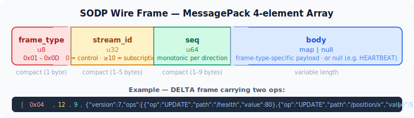
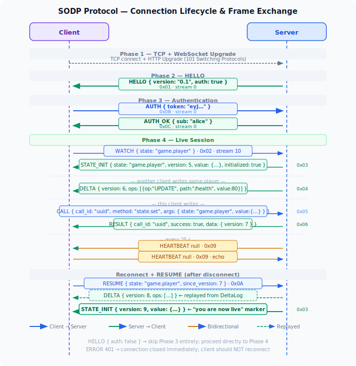

# SODP Wire Protocol Reference

This document describes the exact on-the-wire format of SODP v0.1.  Anyone
building a client or server implementation should use this as the authoritative
reference.

---

## Transport

SODP runs over a persistent **WebSocket** connection.  Every payload is a
binary (opcode `0x02`) WebSocket message.  Text frames and fragmented messages
are not used.

There is no HTTP fallback.  TLS is handled by a reverse proxy in front of the
SODP server (see [deployment.md](deployment.md)).

---

## Frame format

Every message is a **4-element MessagePack array**:

```
[ frame_type: u8,  stream_id: u32,  seq: u64,  body: any ]
```

| Field | Type | Description |
|---|---|---|
| `frame_type` | `u8` | One of the constants in the table below |
| `stream_id` | `u32` | Logical stream (0 = control; ≥ 10 = subscription stream) |
| `seq` | `u64` | Monotonically increasing per direction per stream (may be 0 for server frames that don't require ack) |
| `body` | any | Frame-type-specific payload — always a MessagePack map or null |



Arrays and all body fields follow the **MessagePack specification**.  Integers
use the most compact encoding.

---

## Frame type codes

| Name | Hex | Direction | Description |
|---|---|---|---|
| `HELLO` | `0x01` | S → C | Server greeting; announces auth requirement |
| `WATCH` | `0x02` | C → S | Subscribe to a state key |
| `STATE_INIT` | `0x03` | S → C | Full snapshot of a key |
| `DELTA` | `0x04` | S → C | Incremental change to a key |
| `CALL` | `0x05` | C → S | Invoke a server method |
| `RESULT` | `0x06` | S → C | Successful method response |
| `ERROR` | `0x07` | S → C | Error response |
| `ACK` | `0x08` | C → S | Acknowledge a stream (reserved, not yet used) |
| `HEARTBEAT` | `0x09` | bidirectional | Keep-alive ping |
| `RESUME` | `0x0A` | C → S | Reconnect and replay missed deltas |
| `AUTH` | `0x0B` | C → S | Send a JWT for authentication |
| `AUTH_OK` | `0x0C` | S → C | Authentication accepted |
| `UNWATCH` | `0x0D` | C → S | Cancel a subscription |

---

## Connection lifecycle



### Phase 1 — TCP + WebSocket handshake

The client opens a WebSocket connection.  No SODP frames are exchanged until
the upgrade completes.

### Phase 2 — HELLO (always)

The server immediately sends a `HELLO` frame on stream 0:

```
frame_type: 0x01  stream_id: 0  seq: 0
body: { "version": "0.1", "server": "SODP-RS", "auth": <bool> }
```

- `auth: true` — the server requires a JWT before serving any frames.
- `auth: false` — authentication is disabled; the client may send `WATCH` / `CALL` immediately.

### Phase 3 — Authentication (when `auth: true`)

The client sends `AUTH`:

```
frame_type: 0x0B  stream_id: 0  seq: <n>
body: { "token": "<JWT string>" }
```

The server validates the token:

- **Valid** → `AUTH_OK` on stream 0, then the session becomes live.
- **Invalid / expired** → `ERROR { code: 401, message: "..." }` followed by WebSocket close.

```
AUTH_OK:
frame_type: 0x0C  stream_id: 0  seq: 0
body: { "sub": "<authenticated subject>" }
```

During the AUTH phase the server accepts `HEARTBEAT` frames (echo back
`HEARTBEAT`) and discards all others.

### Phase 4 — Live session

The session is now live.  The client may freely send `WATCH`, `RESUME`,
`CALL`, `UNWATCH`, and `HEARTBEAT` frames.  The server sends `STATE_INIT`,
`DELTA`, `RESULT`, `ERROR`, and `HEARTBEAT` frames.

### Session end

Either side closes the WebSocket.  The server cleans up all subscriptions and
presence bindings for the session.

---

## Frame body schemas

### HELLO (0x01) — S → C

```json
{ "version": "0.1", "server": "SODP-RS", "auth": false }
```

### AUTH (0x0B) — C → S

```json
{ "token": "eyJhbGci..." }
```

### AUTH_OK (0x0C) — S → C

```json
{ "sub": "alice" }
```

### WATCH (0x02) — C → S

```
stream_id: <client-chosen, ≥ 10>
body: { "state": "<key>" }
```

The server opens a new subscription stream.  The `stream_id` in the client's
`WATCH` frame is used as a suggestion; the server may ignore it and echo the
real stream ID back in `STATE_INIT.body.state` instead.  Clients should always
route `STATE_INIT` by `body.state` (the key name), not by `stream_id`.

### STATE_INIT (0x03) — S → C

```
stream_id: <server-assigned for this subscription>
body: {
  "state":       "<key>",
  "version":     <u64>,
  "value":       <any JSON>,
  "initialized": <bool>
}
```

- `version` — the key's version at the time this snapshot was taken.
- `initialized` — `false` when the key has never been written to the server
  (value is `null`); `true` otherwise.

`STATE_INIT` is also sent at the end of a `RESUME` replay as the "you are now
live" marker.

### DELTA (0x04) — S → C

```
stream_id: <subscription stream for this key>
body: {
  "version": <u64>,
  "ops":     [ <DeltaOp>, ... ]
}
```

#### DeltaOp

```json
{ "op": "ADD",    "path": "/field",    "value": <any> }
{ "op": "UPDATE", "path": "/a/b/c",   "value": <any> }
{ "op": "REMOVE", "path": "/field" }
```

- `path` is a [JSON Pointer](https://tools.ietf.org/html/rfc6901).
- `"/"` (root) means the entire value changed (scalar replacement or key deleted).
- `ADD` is used when a field is new (did not exist in the previous value).
- `UPDATE` is used when the field existed and changed.
- `REMOVE` has no `value` field.

A single DELTA frame may contain multiple ops (e.g. one `UPDATE` + one `REMOVE`
if two fields changed simultaneously).

### CALL (0x05) — C → S

```
stream_id: 0  (always control stream)
body: {
  "call_id": "<UUID string>",
  "method":  "<method name>",
  "args":    { ... }
}
```

`call_id` is a client-generated UUID used to correlate the `RESULT` response.

#### Built-in methods

| Method | Required args | Effect |
|---|---|---|
| `state.set` | `state`, `value` | Replace the full value of `state` |
| `state.patch` | `state`, `patch` | Deep-merge `patch` into existing value |
| `state.set_in` | `state`, `path`, `value` | Set a nested field by JSON Pointer |
| `state.delete` | `state` | Remove `state` entirely |
| `state.presence` | `state`, `path`, `value` | Set a nested path bound to session lifetime |

### RESULT (0x06) — S → C

```
stream_id: 0
body: {
  "call_id": "<UUID>",
  "success": true,
  "data":    { "version": <u64> }
}
```

On failure (the server encountered a validation or logic error but the connection
stays alive):

```json
{ "call_id": "<UUID>", "success": false, "data": "<error string>" }
```

### ERROR (0x07) — S → C

Errors that are not tied to a `CALL` (e.g. ACL denial on a WATCH, rate
limiting, invalid frame) are sent as ERROR frames.  The current implementation
does not include a `call_id` in ERROR frames.

```
stream_id: <stream that caused the error, or 0>
body: {
  "code":    <u32>,
  "message": "<human-readable string>"
}
```

| Code | Meaning |
|---|---|
| `400` | Bad request (malformed frame, missing required field) |
| `401` | Unauthenticated (bad/expired JWT) |
| `403` | Forbidden (ACL denial) |
| `409` | Already watching this key on this session |
| `413` | Frame too large |
| `422` | Schema validation failed |
| `429` | Rate limit exceeded |

Codes `401` (session-level) and `413` are followed by a WebSocket close.
All others leave the connection alive.

### RESUME (0x0A) — C → S

```
stream_id: <client-chosen>
body: { "state": "<key>", "since_version": <u64> }
```

The server replays all delta entries for `state` with `version > since_version`
as individual DELTA frames, then sends `STATE_INIT` to mark the stream as live.

If all matching deltas have been evicted from the in-memory log (the log holds
at most 1 000 entries per key), the server skips the replay and sends only
`STATE_INIT` with the current snapshot.

### UNWATCH (0x0D) — C → S

```
stream_id: 0
body: { "state": "<key>" }
```

Cancels the subscription.  The server stops sending DELTAs for this key to
this session and removes the subscriber from the fanout registry.

### HEARTBEAT (0x09) — bidirectional

```
stream_id: 0  seq: 0  body: null
```

Sent by the server every `SODP_WS_PING_INTERVAL` seconds (default: 25 s).
The client must echo a `HEARTBEAT` back.  The server also responds to incoming
`HEARTBEAT` frames with a `HEARTBEAT`.

In addition to application-level heartbeats, the server sends WebSocket
protocol-level `Ping` frames on the same schedule and closes the session if no
`Pong` is received before the next tick.

---

## Stream allocation

| Range | Owner | Purpose |
|---|---|---|
| 0 | both | Control stream — CALL, RESULT, ERROR, HEARTBEAT, AUTH, HELLO |
| 1–9 | reserved | Not currently used |
| ≥ 10 | client | One stream per WATCH / RESUME subscription |

The server echoes back the assigned stream ID for a subscription inside
`STATE_INIT.body.state` (the key name).  Clients that need to route incoming
DELTA frames should build a `stream_id → key` map from `STATE_INIT` bodies,
not from the stream IDs in WATCH frames.

---

## Versioning

Every key has an independent monotonic `version` counter that starts at 0 and
increments on each successful mutation.  The global version counter (shared
across all keys) is what actually increments; each key records the global
version at the time of its last mutation.

This means:
- A key's version numbers are not necessarily contiguous (gaps appear when
  other keys are mutated in between).
- `version` values are always strictly increasing per key.
- `since_version: 0` in a RESUME replays all deltas ever recorded for a key
  (up to the 1 000-entry cap).

---

## Delta encoding example

Initial state of `"game.player"`:

```json
{ "name": "Alice", "health": 100, "position": { "x": 0, "y": 0 } }
```

After `state.patch { "health": 80, "position": { "x": 5 } }`:

```json
{
  "version": 7,
  "ops": [
    { "op": "UPDATE", "path": "/health",      "value": 80 },
    { "op": "UPDATE", "path": "/position/x",  "value": 5  }
  ]
}
```

Only the two changed fields are transmitted.  `name` and `position.y` are
unchanged and produce no ops.

After `state.delete "game.player"`:

```json
{
  "version": 8,
  "ops": [
    { "op": "REMOVE", "path": "/" }
  ]
}
```

---

## Minimal client implementation checklist

1. Open a WebSocket and set `binaryType = "arraybuffer"`.
2. On every binary message, decode with MessagePack and dispatch by `frame[0]` (frame_type).
3. On `HELLO { auth: true }`, send `AUTH { token }` and wait for `AUTH_OK`.
4. On `AUTH_OK` (or `HELLO { auth: false }`), flush any queued `WATCH` / `CALL` frames.
5. On `STATE_INIT`, store `{ value, version, initialized }` keyed by `body.state`.
   Update your `stream_id → key` map from `body.state` + `stream_id`.
6. On `DELTA`, look up the key via `stream_id → key`, apply `ops` to the cached value,
   update `version`.
7. On `HEARTBEAT`, send a `HEARTBEAT` back.
8. On disconnect, reconnect with exponential backoff.  For each watched key
   with a non-zero version, send `RESUME { state, since_version }`.
   For never-seen keys, send `WATCH`.
9. On `ERROR 401`, do not reconnect (token is invalid).  All other errors leave
   the connection alive.
