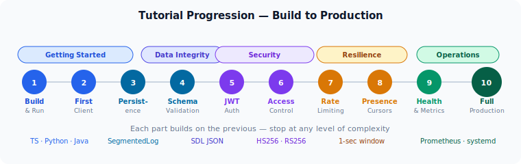

# SODP Step-by-Step Tutorial

This tutorial takes you from zero to a fully-configured SODP server with
authentication, access control, and schema validation.  Each section builds
on the previous one so you can stop at any level of complexity.

---

## Prerequisites

- **Rust** ≥ 1.75 with Cargo (`curl --proto '=https' --tlsv1.2 -sSf https://sh.rustup.rs | sh`)
- **Node.js** ≥ 18 (for the TypeScript client examples)
- **Python** ≥ 3.10 (for the Python client examples)

---



---

## Part 1 — Build and run

### 1.1 Build the server

```bash
git clone https://github.com/your-org/sodp
cd sodp
cargo build        # debug (fast to compile)
# or:
cargo build --release  # optimised for production
```

The server binary is at `target/debug/sodp-server` (or `target/release/`).

### 1.2 Start in ephemeral mode

State lives only in memory.  Everything is lost on restart.  Good for
development and testing.

```bash
RUST_LOG=info ./target/debug/sodp-server 0.0.0.0:7777
```

Expected output:

```
INFO sodp::server: SODP server listening on 0.0.0.0:7777
```

The server is now accepting WebSocket connections on port 7777.

---

## Part 2 — First client

### 2.1 TypeScript

Install and build the client library:

```bash
cd client-ts
npm install
npm run build
cd ..
```

Create `hello.mjs`:

```javascript
import { SodpClient } from "./client-ts/dist/index.js";

const client = new SodpClient("ws://localhost:7777");
await client.ready;
console.log("Connected!");

// Subscribe to a key that doesn't exist yet
const unsub = client.watch("game.score", (value, meta) => {
  console.log("score:", value, "  version:", meta.version, "  initialized:", meta.initialized);
});

// Wait for STATE_INIT (the initial snapshot)
await new Promise(r => setTimeout(r, 200));

// Write a value
await client.set("game.score", { score: 0 });

// Update it
await client.set("game.score", { score: 10 });

// Patch one field (the other fields are preserved)
await client.patch("game.score", { score: 11 });

await new Promise(r => setTimeout(r, 100));
unsub();
client.close();
```

Run it:

```bash
node hello.mjs
```

Expected output (the first line has `initialized: false` because the key
didn't exist yet when we subscribed):

```
score: null    version: 0   initialized: false
score: {score:0}  version: 1   initialized: true
score: {score:10} version: 2   initialized: true
score: {score:11} version: 3   initialized: true
```

### 2.2 Python

Install the client:

```bash
pip install -e sodp-py/
```

Create `hello.py`:

```python
import asyncio
from sodp.client import SodpClient

async def main():
    client = SodpClient("ws://localhost:7777")
    await client.ready
    print("Connected!")

    def on_update(value, meta):
        print(f"score: {value}  version: {meta.version}  initialized: {meta.initialized}")

    client.watch("game.score", on_update)
    await asyncio.sleep(0.2)  # wait for STATE_INIT

    await client.set("game.score", {"score": 0})
    await client.set("game.score", {"score": 10})
    await client.patch("game.score", {"score": 11})

    await asyncio.sleep(0.1)
    client.close()

asyncio.run(main())
```

```bash
python hello.py
```

---

## Part 3 — Persistence

Without persistence the server loses all state on restart.  A log directory
makes it durable.

### 3.1 Start with persistence

```bash
mkdir -p /tmp/sodp-log
RUST_LOG=info ./target/debug/sodp-server 0.0.0.0:7777 /tmp/sodp-log
```

Write some state (using the TypeScript script from Part 2, or any client).
Then stop and restart the server:

```bash
# Ctrl-C to stop
RUST_LOG=info ./target/debug/sodp-server 0.0.0.0:7777 /tmp/sodp-log
```

The server replays the log on startup:

```
INFO sodp::log: Log: replayed 3 entries from "/tmp/sodp-log/seg_0000000000.log"
INFO sodp::server: SODP server listening on 0.0.0.0:7777
```

Reconnect a client and `watch("game.score")` — it will receive the previously
written value immediately in `STATE_INIT`.

### 3.2 Log files

```bash
ls /tmp/sodp-log/
# seg_0000000000.log
```

Each segment holds up to 100 000 entries.  When a segment is full, a new one
is created automatically.  When more than 3 segments accumulate, compaction
runs automatically:

```
INFO sodp::log: Log: compacted — snapshot in "seg_0000000003.log", writing to "seg_0000000004.log" (2 keys)
```

After compaction only 2 segment files remain: the snapshot and the live write
segment.

---

## Part 4 — Schema validation

Schema validation prevents invalid data from entering the system.  The server
rejects writes that don't match the declared types.

### 4.1 Write a schema file

Create `/tmp/sodp-schema.json`:

```json
{
  "game.player": {
    "type": "Object",
    "fields": {
      "name":   { "type": "String" },
      "health": { "type": "Int" },
      "score":  { "type": "Int" }
    }
  },
  "game.config": {
    "type": "Object",
    "fields": {
      "max_players": { "type": "Int" },
      "map":         { "type": "String" }
    }
  }
}
```

### 4.2 Start with schema

```bash
RUST_LOG=info ./target/debug/sodp-server 0.0.0.0:7777 /tmp/sodp-log /tmp/sodp-schema.json
```

### 4.3 Observe validation

A valid write succeeds:

```javascript
await client.set("game.player", { name: "Alice", health: 100, score: 0 });
// → RESULT { version: N }
```

An invalid write fails:

```javascript
await client.set("game.player", { name: 42, health: 100 });
// → throws: [SODP] ERROR 422: field "name": expected String, got Int
```

Undeclared keys are always allowed (permissive by default):

```javascript
// game.chat is not in the schema → no validation → succeeds
await client.set("game.chat", { message: "hello" });
```

---

## Part 5 — JWT Authentication

Authentication ensures only clients with a valid token can connect.

### 5.1 HS256 (development)

For development, a shared secret is simplest.

```bash
SODP_JWT_SECRET=my-dev-secret RUST_LOG=info ./target/debug/sodp-server 0.0.0.0:7777
```

Generate a test token with Python (no library needed):

```python
import base64, hmac, hashlib, json, time

def make_jwt(secret, sub, extra=None):
    h = base64.urlsafe_b64encode(json.dumps({"alg":"HS256","typ":"JWT"}).encode()).rstrip(b"=")
    p = {"sub": sub, "exp": int(time.time()) + 3600}
    if extra: p.update(extra)
    b = base64.urlsafe_b64encode(json.dumps(p).encode()).rstrip(b"=")
    m = h + b"." + b
    s = base64.urlsafe_b64encode(hmac.new(secret.encode(), m, hashlib.sha256).digest()).rstrip(b"=")
    return (m + b"." + s).decode()

print(make_jwt("my-dev-secret", "alice"))
```

Use the token in the client:

```javascript
const client = new SodpClient("ws://localhost:7777", { token: "eyJ..." });
```

```python
client = SodpClient("ws://localhost:7777", token="eyJ...")
```

A client without a token receives `ERROR 401` and the connection closes.

### 5.2 RS256 (production)

Generate a key pair:

```bash
openssl genrsa -out private.pem 2048
openssl rsa -in private.pem -pubout -out public.pem
```

Start the server with the public key:

```bash
SODP_JWT_PUBLIC_KEY_FILE=public.pem \
RUST_LOG=info ./target/debug/sodp-server 0.0.0.0:7777
```

Your backend signs tokens with `private.pem`.  The SODP server only ever sees
`public.pem` — it can verify tokens but not issue them.

Example signer (Node.js with `jsonwebtoken`):

```javascript
import jwt from "jsonwebtoken";
import fs from "fs";

const privateKey = fs.readFileSync("private.pem");

const token = jwt.sign(
  { sub: "alice", exp: Math.floor(Date.now() / 1000) + 3600 },
  privateKey,
  { algorithm: "RS256" }
);
```

### 5.3 Token rotation

When tokens expire, clients should transparently obtain a new one and
reconnect.  Use `tokenProvider`:

```javascript
const client = new SodpClient("wss://sodp.example.com", {
  tokenProvider: async () => {
    const res = await fetch("/api/sodp-token");
    return res.text();
  },
});
```

```python
async def get_token():
    async with aiohttp.ClientSession() as s:
        return await (await s.get("https://api.example.com/sodp-token")).text()

client = SodpClient("wss://sodp.example.com", token_provider=get_token)
```

The provider is called on every connect and reconnect — tokens are always
fresh.

---

## Part 6 — Access control (ACL)

ACL rules determine which keys each user can read or write.

### 6.1 Simple user isolation

Create `/tmp/acl.json`:

```json
{
  "rules": [
    { "key": "public.*",     "read": "*",     "write": "*"     },
    { "key": "user.{sub}.*", "read": "{sub}", "write": "{sub}" }
  ]
}
```

Start the server:

```bash
SODP_JWT_SECRET=my-dev-secret \
SODP_ACL_FILE=/tmp/acl.json \
RUST_LOG=info ./target/debug/sodp-server 0.0.0.0:7777
```

With Alice's token (`sub: "alice"`):

```javascript
// Alice's own key — allowed
await client.set("user.alice.notes", { text: "hello" });    // OK

// Another user's key — forbidden
await client.set("user.bob.notes", { text: "hack" });       // ERROR 403

// Public key — allowed by anyone
await client.set("public.board", { msg: "hi" });            // OK
```

### 6.2 Role-based access with Keycloak

Create `/tmp/acl.json`:

```json
{
  "preset": "keycloak",
  "rules": [
    { "key": "public.*",     "read": "*",          "write": "*"          },
    { "key": "user.{sub}.*", "read": "{sub}",      "write": "{sub}"      },
    { "key": "admin.*",      "read": "role:admin", "write": "role:admin" }
  ]
}
```

Keycloak JWTs include `realm_access.roles`.  The `keycloak` preset maps
`role` → `realm_access.roles` automatically.

```python
# Token with realm_access.roles = ["user"]
alice_jwt = make_jwt("my-dev-secret", "alice",
    {"realm_access": {"roles": ["user"]}})

# Token with realm_access.roles = ["user", "admin"]
admin_jwt = make_jwt("my-dev-secret", "admin",
    {"realm_access": {"roles": ["user", "admin"]}})
```

```python
alice  = SodpClient("ws://localhost:7777", token=alice_jwt)
admin_ = SodpClient("ws://localhost:7777", token=admin_jwt)
await alice.ready
await admin_.ready

await alice.set("admin.config",  {"k": "v"})  # ERROR 403 — alice lacks admin role
await admin_.set("admin.config", {"k": "v"})  # OK
```

### 6.3 Multi-tenant isolation

```json
{
  "preset": "generic",
  "rules": [
    { "key": "tenant.{sub}.*", "read": "tenant:{sub}", "write": "tenant:{sub}" }
  ]
}
```

The JWT must include a `tenant_id` claim.  A user whose `tenant_id = "acme"`
can only read and write keys under `tenant.acme.*`.

```python
# tenant_id = "acme"
alice_jwt = make_jwt("my-dev-secret", "alice", {"tenant_id": "acme"})

# alice can write tenant.acme.settings (tenant_id matches captured "acme")
await client.set("tenant.acme.settings", {"plan": "pro"})  # OK

# alice cannot write tenant.other.settings (tenant_id doesn't match "other")
await client.set("tenant.other.settings", {"plan": "pro"})  # ERROR 403
```

---

## Part 7 — Rate limiting

Protect the server from write-heavy clients.

```bash
SODP_JWT_SECRET=my-dev-secret \
SODP_ACL_FILE=/tmp/acl.json \
SODP_RATE_WRITES_PER_SEC=10 \
SODP_RATE_WATCHES_PER_SEC=5 \
RUST_LOG=info ./target/debug/sodp-server 0.0.0.0:7777
```

A client that sends more than 10 CALL frames per second receives `ERROR 429`
for the excess frames.  The connection stays alive and writes succeed again
after the 1-second window resets.

---

## Part 8 — Presence

Presence binds a nested state path to the session's lifetime.  When the
client disconnects for any reason the server removes the path and broadcasts
the change to all watchers — eliminating ghost cursor/user entries.

### 8.1 Collaborative editor example

All connected editors watch `"collab.cursors"`.  Each editor registers its
own cursor under its user ID:

```javascript
const cursors = client.state("collab.cursors");

// Subscribe to all cursors
cursors.watch((value, meta) => {
  renderCursors(value);  // value is { alice: {line,col}, bob: {line,col}, ... }
});

// Register my cursor — auto-removed when I disconnect
await cursors.presence(`/${myUserId}`, { name: displayName, line: 0, col: 0 });

// Move my cursor (presence binding stays; just update the value)
document.addEventListener("selectionchange", async () => {
  const { line, col } = getCaretPosition();
  await client.patch("collab.cursors", { [myUserId]: { line, col } });
});
```

When a user closes their tab or loses the network connection, their entry
disappears from `collab.cursors` automatically and all other watchers receive
a DELTA with a `REMOVE` op.

---

## Part 9 — Health check and monitoring

### 9.1 Health endpoint

```bash
SODP_HEALTH_PORT=7778 \
RUST_LOG=info ./target/debug/sodp-server 0.0.0.0:7777
```

```bash
curl http://localhost:7778/
# {"status":"ok","connections":0,"version":"0.1"}
```

### 9.2 Prometheus metrics

```bash
SODP_METRICS_PORT=9090 \
RUST_LOG=info ./target/debug/sodp-server 0.0.0.0:7777
```

```bash
curl -s http://localhost:9090/metrics | grep sodp
```

---

## Part 10 — Full production configuration

This is a complete configuration combining all features:

### 10.1 Environment file

Create `/etc/sodp/env`:

```bash
# Authentication — RS256
SODP_JWT_PUBLIC_KEY_FILE=/etc/sodp/public.pem

# Access control
SODP_ACL_FILE=/etc/sodp/acl.json

# Rate limiting
SODP_RATE_WRITES_PER_SEC=100
SODP_RATE_WATCHES_PER_SEC=50

# Observability
SODP_HEALTH_PORT=7778
SODP_METRICS_PORT=9090

# Connection guard
SODP_MAX_CONNECTIONS=10000
SODP_MAX_FRAME_BYTES=1048576

# Logging
RUST_LOG=info
```

### 10.2 Systemd unit

Create `/etc/systemd/system/sodp.service`:

```ini
[Unit]
Description=SODP State Server
After=network.target

[Service]
ExecStart=/usr/local/bin/sodp-server 0.0.0.0:7777 /var/lib/sodp/log /etc/sodp/schema.json
EnvironmentFile=/etc/sodp/env
Restart=always
RestartSec=2s
User=sodp
WorkingDirectory=/var/lib/sodp
LimitNOFILE=65536

[Install]
WantedBy=multi-user.target
```

```bash
sudo useradd -r -d /var/lib/sodp -s /sbin/nologin sodp
sudo mkdir -p /var/lib/sodp/log
sudo chown sodp:sodp /var/lib/sodp/log
sudo systemctl enable --now sodp
```

### 10.3 Nginx TLS proxy

```nginx
server {
    listen 443 ssl http2;
    server_name sodp.example.com;

    ssl_certificate     /etc/letsencrypt/live/sodp.example.com/fullchain.pem;
    ssl_certificate_key /etc/letsencrypt/live/sodp.example.com/privkey.pem;
    ssl_protocols       TLSv1.2 TLSv1.3;

    location / {
        proxy_pass          http://127.0.0.1:7777;
        proxy_http_version  1.1;
        proxy_set_header Upgrade    $http_upgrade;
        proxy_set_header Connection "upgrade";
        proxy_set_header Host       $host;
        proxy_read_timeout  3600s;
        proxy_send_timeout  3600s;
    }
}
```

### 10.4 Docker Compose

```yaml
services:
  sodp:
    image: sodp:latest
    restart: unless-stopped
    ports:
      - "7777:7777"    # WebSocket (TLS terminated by nginx)
      - "7778:7778"    # Health check (internal only)
      - "9090:9090"    # Metrics (internal only)
    environment:
      SODP_JWT_PUBLIC_KEY_FILE: /run/secrets/sodp_public_key
      SODP_ACL_FILE: /etc/sodp/acl.json
      SODP_RATE_WRITES_PER_SEC: "100"
      SODP_HEALTH_PORT: "7778"
      SODP_METRICS_PORT: "9090"
      RUST_LOG: info
    volumes:
      - sodp-log:/var/lib/sodp/log
      - ./acl.json:/etc/sodp/acl.json:ro
      - ./schema.json:/etc/sodp/schema.json:ro
    secrets:
      - sodp_public_key
    command: ["sodp-server", "0.0.0.0:7777", "/var/lib/sodp/log", "/etc/sodp/schema.json"]

volumes:
  sodp-log:

secrets:
  sodp_public_key:
    file: ./public.pem
```

---

## Troubleshooting

### Connection refused

Check the server is running and on the right port:

```bash
ss -tlnp | grep 7777
```

### ERROR 401

The JWT is invalid or expired.  Verify the secret/key matches and the token's
`exp` is in the future:

```bash
# Decode a JWT (header.payload.signature)
echo "eyJ..." | cut -d. -f2 | base64 -d 2>/dev/null | python3 -m json.tool
```

### ERROR 403

The ACL is denying access.  Increase log verbosity to see which rule matched:

```bash
RUST_LOG=debug ./target/debug/sodp-server 0.0.0.0:7777
```

Look for `"ACL loaded"` in the log to confirm the file was parsed, and
verify the rule patterns and claim paths are correct for your IdP.

### State lost after restart

Persistence requires a log directory as the second argument:

```bash
sodp-server 0.0.0.0:7777 /var/lib/sodp/log
#                          ^^^^^^^^^^^^^^^^^ this must be present
```

Check the log for replay messages at startup:

```
INFO sodp::log: Log: replayed 1234 entries from "seg_0000000000.log"
```

### High memory usage

The DeltaLog holds up to 1 000 mutations per key in memory.  With many keys
and large values this can grow.  This is normal — the cap prevents unbounded
growth.  If total memory is still too high, the values themselves are large;
consider splitting large objects into smaller keys.
